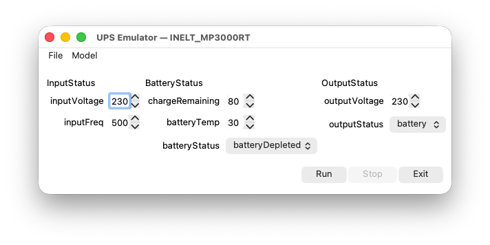

# ups_monitor

`ups_monitor` — консольное приложение для мониторинга одного ИБП по SNMP v2c. Приложение автоматически определяет модель ИБП, периодически запрашивает заданные в её спецификации параметры и выводит общее состояние с битовой маской отклонений.

Поддерживаемые модели и критерии нормального состояния задаются в конфигурации и могут изменяться без перекомпиляции приложения.

## Документация

- [Функциональные требования](docs/technical_specification/functional_requirements.md)
- [API приложения и формат конфигурации](docs/technical_specification/api.md)
- [Протокол взаимодействия с ИБП по SNMP](docs/technical_specification/snmp_protocol.md)

Для локальной генерации HTML-документации необходимы Doxygen и Graphviz. Сборка документации с автоматическим открытием главной страницы запускается командой:

```bash
./docs/doxygen/doc_generation.sh
```

Чтобы не открывать документацию после сборки:

```bash
./docs/doxygen/doc_generation.sh --no-open
```

## Требования

Для работы с проектом через `./prj` необходимы Git и Docker. Для локальной сборки без Docker также требуются CMake и компилятор C++, а для графического интерфейса эмулятора — Qt 5.

Эмулятор ИБП подключён как Git submodule и используется при сборке тестового runtime и выполнении интеграционных тестов. После клонирования репозитория его нужно инициализировать:

```bash
git submodule update --init --recursive
```

Для сборки основного приложения без интеграционных тестов submodule не требуется.

## Запуск

Запуск с адресом и портом по умолчанию (`127.0.0.1:161`):

```bash
./prj run
```

Запуск с явным указанием IPv4-адреса и UDP-порта ИБП:

```bash
./prj run --ip 192.168.1.10 --port 161
```

Поддерживаемые аргументы:

- `--ip <IPv4>` — IPv4-адрес ИБП;
- `--port <номер>` — UDP-порт SNMP-агента в диапазоне от `1` до `65535`;
- `--help` — вывести справку и завершить работу.

Для штатного завершения мониторинга используется `Ctrl+C`.

## Сборка

Основная точка входа в инфраструктуру проекта:

| Команда | Назначение |
|---|---|
| `./prj build` | Собрать проект |
| `./prj utest` | Запустить модульные тесты |
| `./prj itest` | Запустить интеграционные тесты |
| `./prj test` | Запустить все тесты |
| `./prj run` | Запустить приложение |
| `./prj pack` | Собрать DEB-пакет |
| `./prj cov` | Сформировать отчёт о покрытии |
| `./prj build-emulator` | Собрать тестовый runtime эмулятора ИБП |
| `./prj cppcheck` | Выполнить статический анализ Cppcheck |
| `./prj tidy` | Выполнить статический анализ clang-tidy |
| `./prj clean` | Очистить результаты сборки |
| `./prj help` | Вывести справку по командам |

Сборка выполняется в Docker-контейнере с окружением целевой платформы. Каталог `build/` создаётся и используется скриптами проекта.

Ручная сборка через `cmake` допускается для отладки, но она может создать `build/CMakeCache.txt` с путями хост-системы. После ручной сборки перед использованием `./prj` необходимо очистить каталог сборки:

```bash
./prj clean
./prj build
```

## Локальная проверка с эмулятором

Для проверки без реального ИБП нужно отдельно собрать и запустить эмулятор, а затем — `ups_monitor`.

Сборка GUI-эмулятора выполняется из корня репозитория:

```bash
cmake -S tests/ups_emulator -B tests/ups_emulator/build
cmake --build tests/ups_emulator/build -j8
```

Запустите графический интерфейс:

```bash
./tests/ups_emulator/build/bin/ups_emulator_gui
```



Выберите модель и значения параметров ИБП, затем нажмите кнопку `Run`. Эмулятор запустит SNMP-агент на UDP-порту `161`. На системах, где этот порт является привилегированным, для запуска могут потребоваться повышенные права.

В другом терминале очистите результаты предыдущей сборки, соберите приложение без тестов и запустите его:

```bash
./prj clean
cmake -S . -B build -DBUILD_TESTING=OFF
cmake --build build -j8
./build/bin/ups_monitor
```

После успешного определения модели монитор начнёт выводить её состояние. Например:

```text
2026-08-03 15:50:10 [UPS] detected model="MP3000RT"
2026-08-03 15:50:10 [UPS] status=WARNING deviations=0x00000001 (BATTERY_ALERT)
2026-08-03 15:50:11 [UPS] status=WARNING deviations=0x00000001 (BATTERY_ALERT)
```

Не останавливая эмулятор и монитор, измените один или несколько параметров в GUI. Монитор должен отреагировать на новые значения в следующем цикле опроса. Например, после изменения `batteryStatus` с `batteryDepleted` на `batteryNormal` состояние изменится с `WARNING` на `OK`:

```text
2026-08-03 15:50:12 [UPS] status=WARNING deviations=0x00000001 (BATTERY_ALERT)
2026-08-03 15:50:13 [UPS] status=WARNING deviations=0x00000001 (BATTERY_ALERT)
2026-08-03 15:50:14 [UPS] status=OK deviations=0x00000000 (NONE)
2026-08-03 15:50:15 [UPS] status=OK deviations=0x00000000 (NONE)
```

Конкретное состояние и набор отклонений зависят от выбранных в эмуляторе значений. Для завершения монитора нажмите `Ctrl+C`, после чего остановите эмулятор кнопкой `Stop` или закройте его.

## Версия проекта

Версия проекта задаётся в одном месте:

```text
cmake/project_version.cmake
```

Перед релизом нужно вручную изменить значение:

```cmake
set(PROJECT_VERSION_VALUE 0.1.0)
```

Формат версии:

```text
MAJOR.MINOR.PATCH
```

Когда версия готова к релизу, на соответствующий commit ставится Git tag с тем же номером и префиксом `v`:

```bash
git tag v0.1.0
git push origin v0.1.0
```

Push релизного тега запускает GitHub Actions workflow, который собирает проект, выполняет тесты, формирует DEB-пакет, создаёт GitHub Release и публикует Doxygen-документацию на GitHub Pages.

Release workflow проверяет, что версия из тега совпадает с версией из `cmake/project_version.cmake`. Если значения отличаются, релизная сборка завершается ошибкой.
