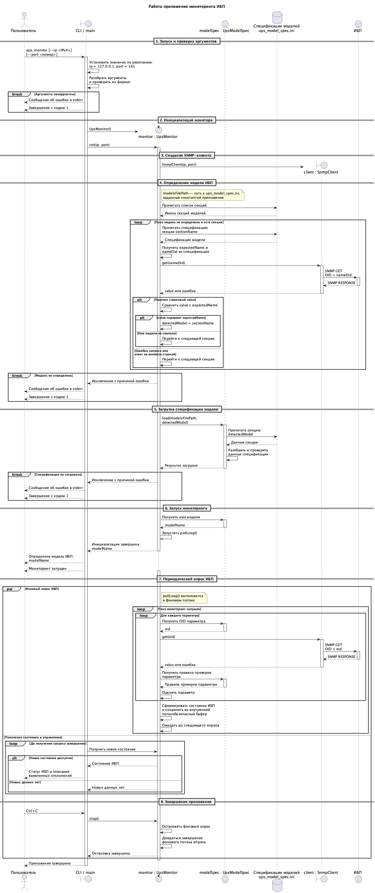

# Функциональные требования

## 1. Назначение

Приложение предназначено для мониторинга одного ИБП по протоколу SNMP. Оно определяет модель ИБП, периодически запрашивает его параметры и формирует общее состояние с указанием причин отклонений.

## 2. Требования

| № | Требование |
|---|---|
| 1 | Приложение должно принимать IPv4-адрес и UDP-порт ИБП через аргументы командной строки либо использовать значения по умолчанию: `127.0.0.1` и `161`. |
| 2 | Приложение должно загружать из файла данные спецификаций поддерживаемых моделей. Каждая спецификация должна содержать название модели, идентификационный OID, OID контролируемых параметров и критерии их нормального состояния. |
| 3 | Приложение должно автоматически определять модель ИБП по значению идентификационного OID. Если модель не определена, мониторинг не запускается. |
| 4 | После определения модели приложение должно периодически запрашивать параметры ИБП, заданные в её спецификации. |
| 5 | Полученные значения должны проверяться по допустимому диапазону или перечню значений из спецификации модели. |
| 6 | После каждого цикла опроса приложение должно формировать общее состояние ИБП и битовую маску отклонений. |
| 7 | Ошибка получения одного параметра не должна прерывать обработку остальных параметров. |
| 8 | Добавление модели с поддерживаемыми параметрами должно выполняться изменением файла спецификаций без изменения исходного кода. |
| 9 | Приложение должно корректно останавливать опрос и освобождать сетевые ресурсы. |

## 3. Последовательность работы приложения

Запуск приложения, определение модели ИБП, периодический опрос и завершение работы показаны на диаграмме:

## 4. Контролируемые параметры

При отклонении параметра от нормы соответствующий бит устанавливается в битовой маске отклонений состояния ИБП.

| Параметр | Критерий нормы | Критичный | Бит в маске отклонений |
|---|---|---:|---:|
| Состояние батареи | Данные от ИБП — батарея исправна | Нет | `0x00000001` |
| Уровень заряда | Не менее `30 %` | Нет | `0x00000002` |
| Температура батареи | От `0` до `50 °C` | Нет | `0x00000004` |
| Входная частота | От `40` до `60 Гц` | Нет | `0x00000008` |
| Входное напряжение | От `200` до `259 В` | Нет | `0x00000010` |
| Выходное напряжение | От `200` до `259 В` | Да | `0x00000020` |
| Режим байпаса | ИБП не работает в режиме байпаса | Нет | `0x00000040` |

Одновременно могут быть установлены несколько битов отклонений.

## 5. Состояния ИБП

| Состояние | Условие |
|---|---|
| `OK` | Значения всех параметров успешно получены и соответствуют норме. |
| `WARNING` | Получен хотя бы один SNMP-ответ и обнаружено отклонение некритичного параметра от нормы либо не получено его значение; выходное напряжение находится в допустимом диапазоне. |
| `FAILURE` | Получен хотя бы один SNMP-ответ, а значение выходного напряжения не получено или находится вне нормы. |
| `NO_INFO` | Не удалось получить ни одного SNMP-ответа. |

## 6. Ограничения

- Приложение может одновременно контролировать только один ИБП.
- Для обмена данными используются протоколы IPv4 и UDP.
- Для взаимодействия с ИБП поддерживаются протоколы SNMP v1 и SNMP v2c; по умолчанию используется SNMP v2c.
- Приложение только запрашивает данные с помощью операции GET и не изменяет параметры ИБП.
- Приложение не принимает и не обрабатывает асинхронные SNMP-уведомления (traps).
