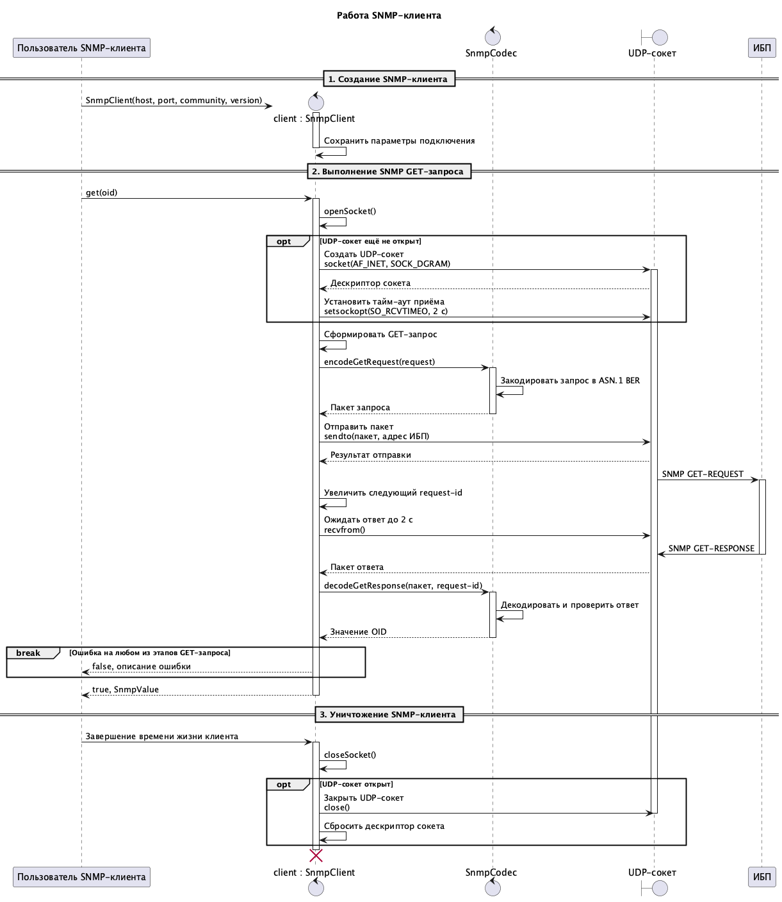

# Протокол взаимодействия с ИБП по SNMP

## 1. Участники

| Участник | Роль |
|---|---|
| `ups_monitor` | SNMP manager: формирует запросы и анализирует ответы |
| ИБП | SNMP agent: принимает запросы и возвращает значения OID |

Инициатором обмена всегда является `ups_monitor`.

## 2. Транспорт

- сетевой уровень: IPv4;
- транспорт: UDP;
- порт SNMP-агента: `161` по умолчанию;
- тайм-аут ответа: `2000` мс;
- повторная отправка запроса не выполняется.

## 3. Параметры SNMP

- поддерживаемые версии: SNMP v1 и SNMP v2c;
- версия по умолчанию: SNMP v2c;
- community string по умолчанию: `public`;
- кодирование сообщений: ASN.1 BER;
- поддерживаемая операция: SNMP GET.

SNMP SET, GET-NEXT, GET-BULK, TRAP, INFORM и SNMP v3 не поддерживаются.

## 4. GET-запрос

Клиент отправляет сообщение следующей логической структуры:

```text
SNMP Message
├── version
├── community
└── GetRequest-PDU
    ├── request-id
    ├── error-status = 0
    ├── error-index = 0
    └── VarBindList
        └── VarBind
            ├── OID
            └── NULL
```

`request-id` увеличивается после успешной отправки каждого запроса, обеспечивая различие идентификаторов последовательных запросов, и используется для сопоставления ответа с отправленным запросом.

Один запрос может содержать один или несколько OID.

## 5. GET-ответ

Агент должен вернуть сообщение:

```text
SNMP Message
├── version
├── community
└── GetResponse-PDU
    ├── request-id
    ├── error-status
    ├── error-index
    └── VarBindList
        └── VarBind
            ├── OID
            └── value
```

Ответ считается успешным, если:

- сообщение корректно закодировано ASN.1 BER;
- используется SNMP v1 или SNMP v2c, и версия ответа совпадает с версией запроса;
- PDU имеет тип GET-RESPONSE;
- `request-id` совпадает с идентификатором запроса;
- `error-status` равен `0`;
- каждый элемент `VarBind` списка `VarBindList` содержит OID и поле значения поддерживаемого типа; для одиночного GET список `VarBindList` не должен быть пустым.

При ненулевом `error-status` поле `error-index` указывает номер ошибочного элемента в `VarBindList`.

## 6. Последовательность работы SNMP-клиента

Создание SNMP-клиента, выполнение GET-запроса, обработка ответа и освобождение сетевых ресурсов показаны на диаграмме:



## 7. Поддерживаемые типы значений

| Тип SNMP | Внутреннее представление |
|---|---|
| `INTEGER` | целое число |
| `Gauge32` | целое число |
| `Counter32` | целое число |
| `TimeTicks` | целое число |
| `OCTET STRING` | строка |
| `NULL` | значение отсутствует |

Другие типы значений считаются неподдерживаемыми.
